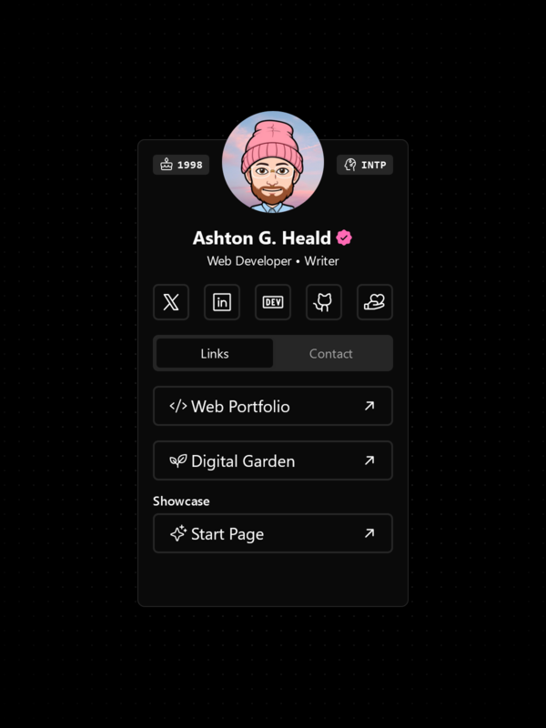
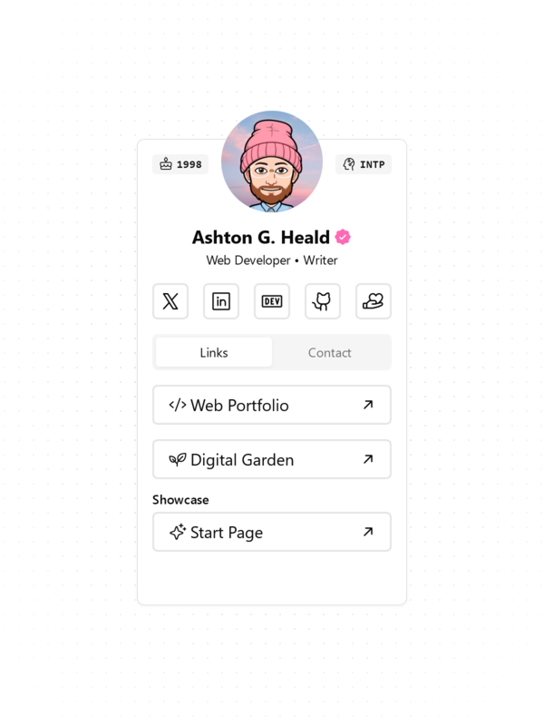
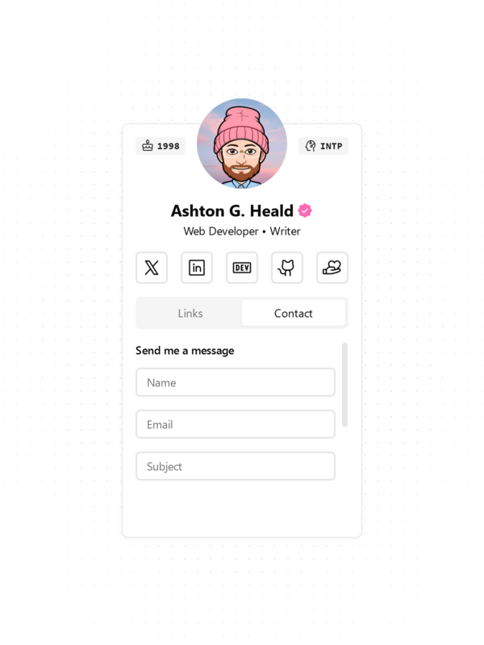
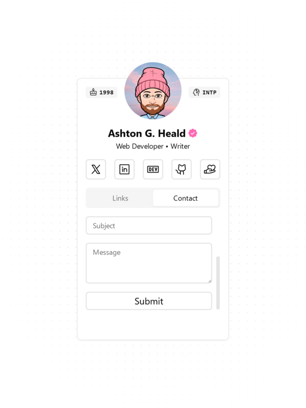

  
  <h1>Link in bio</h1>
  <h4>
    <a href="https://ashtonheald.me/">View Demo</a>
  </h4>

### Screenshots

  
|||
|:---:|:---:|
|||

### Description
  
My personal link in bio, designed to showcase all the essential aspects of my digital presence.

### Todo
- Remove unused libraries

